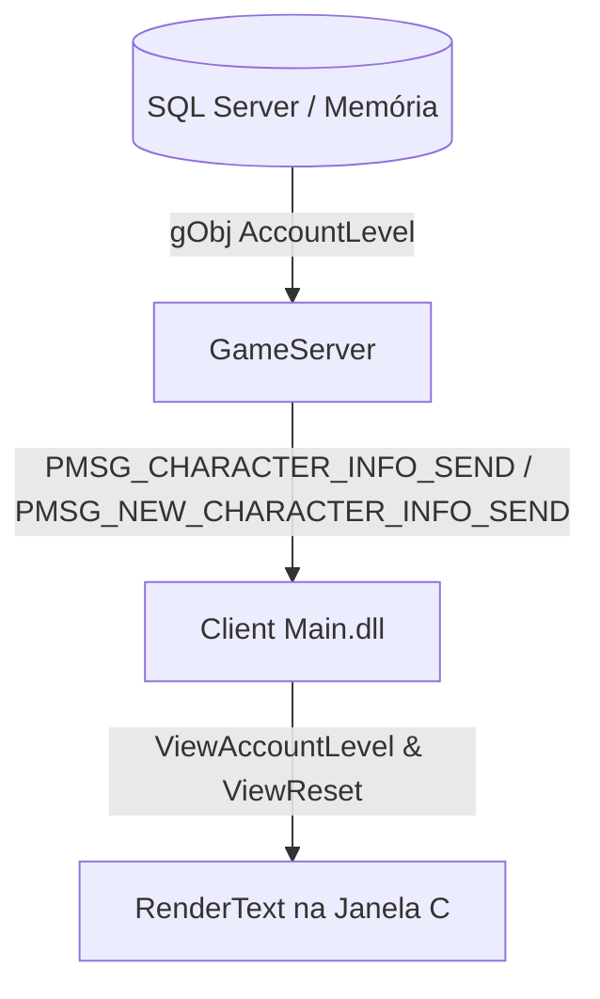

# UPDATE CMZ 15 (3.1.5) - Custom: Texto Visual na Janela de Status ("C")

> **Documentação Técnica Oficial de Customização - CMZone / CMZ SSeMU 97k**  
> **Versão do Pacote:** UPDATE CMZ 15 (3.1.5)  
> **Status:** Implementado, Sincronizado e Validado no Cliente e Servidor  

---

## 1. Visão Geral da Funcionalidade

Esta customização implementa a exibição dinâmica do **número de Resets** e do **Tipo de Conta (Plano VIP)** do personagem diretamente na Janela de Status (tecla **"C"** do teclado), ao lado da caixa de Level e alinhada com o bloco de Pontos a Distribuir (`Point:`).

### Tipos de Conta Suportados:
| ID (AccountLevel) | Nome Exibido no Cliente | Descrição |
|:---:|:---|:---|
| **0** | `Free` | Jogador comum sem assinatura VIP |
| **1** | `Vip` | Jogador com plano VIP básico |
| **2** | `Vip Premium` | Jogador com plano VIP intermediário / premium |
| **3** | `Vip Events` | Jogador com plano VIP de eventos especiais |

---

## 2. Emuladores e Componentes Modificados



### Detalhamento por Componente:
1. **GameServer (MuServer):**
   - **Necessitou de Alteração:** **SIM**.
   - **Motivo:** O GameServer já recebia o plano VIP da conta no login (`gObj[aIndex].AccountLevel`), porém o pacote padrão de informações do personagem enviado ao entrar no mapa (`PMSG_CHARACTER_INFO_SEND` e `PMSG_NEW_CHARACTER_INFO_SEND`) não transmitia essa informação para o Main.
   - **Ação:** O campo `BYTE AccountLevel` foi adicionado nas estruturas de envio de ambos os pacotes, preenchendo com `lpMsg.AccountLevel = gObj[aIndex].AccountLevel;`.

2. **JoinServer / DataServer:**
   - **Necessitou de Alteração:** **NÃO**.
   - **Motivo:** O JoinServer e DataServer já gerenciam as credenciais e carregam o nível de conta nas procedures de autenticação (`AccountLevel`), transmitindo-o para a sessão do jogador no GameServer.

3. **Client (Main.dll):**
   - **Necessitou de Alteração:** **SIM**.
   - **Motivo:** O Main precisava receber o novo campo no protocolo de rede, armazená-lo em uma variável acessível (`ViewAccountLevel`) e interceptar a renderização da janela de personagem para desenhar os textos customizados com a formatação e alinhamento corretos.

---

## 3. Arquivos Modificados e Criados (`.cpp` e `.h`)

### No GameServer (`Source97K-2.4.3-SSeMU\Source\Emulator\GameServer\`):
- `Protocol.h`:
  - Adição do campo `BYTE AccountLevel;` nas structs `PMSG_CHARACTER_INFO_SEND` e `PMSG_NEW_CHARACTER_INFO_SEND`.
- `Protocol.cpp`:
  - Atualização da função `GCCharacterInfoSend(int aIndex)`: atribuição de `lpMsg.AccountLevel = (BYTE)gObj[aIndex].AccountLevel;` e envio com o novo tamanho de pacote alinhado.
- `DSProtocol.cpp` e `JSProtocol.cpp`:
  - Validação e compatibilização do tráfego do `AccountLevel` mantendo integridade com as regras do servidor.

### No Client Main (`Source97K-2.4.3-SSeMU\Source\Main_097K-KOR\Main\`):
- `Protocol.h`:
  - Adição do campo `BYTE AccountLevel;` nas structs `PMSG_CHARACTER_INFO_RECV` e `PMSG_NEW_CHARACTER_INFO_RECV`.
- `Protocol.cpp`:
  - Atualização dos manipuladores `GCCharacterInfoRecv` e `GCNewCharacterInfoRecv` com a linha:
    ```cpp
    ViewAccountLevel = lpMsg->AccountLevel;
    ```
- `PrintPlayer.h`:
  - Declaração da variável global:
    ```cpp
    extern DWORD ViewAccountLevel;
    ```
  - Declaração do protótipo da função hookada:
    ```cpp
    int PrintPlayerRenderLevelText(int iPos_x, int iPos_y, char *pszText, int iBoxWidth, int iSort, SIZE *lpTextSize);
    ```
- `PrintPlayer.cpp`:
  - Instanciação da variável `DWORD ViewAccountLevel = 0;`.
  - Instalação do hook em `InitPrintPlayer()`:
    ```cpp
    SetCompleteHook(0xE8, 0x004ED3A5, &PrintPlayerRenderLevelText);
    ```
  - Implementação da função `PrintPlayerRenderLevelText`.

---

## 4. Offsets Nativas e Hooks Utilizados

| Endereço (Offset) | Tipo | Descrição Técnica |
|:---:|:---:|:---|
| `0x004ED3A5` | **Hook CALL (0xE8)** | Ponto de chamada original de `RenderText` dentro da rotina que renderiza o texto de Level na janela de status (`Character Status Window`). Ao interceptar este ponto, temos acesso às coordenadas base `(iPos_x, iPos_y)` da janela. |
| `0x0047F650` | **Função Nativa** | Função original `RenderText(int x, int y, char* text, int width, int sort, SIZE* size)` do cliente 97k Webzen, responsável pelo cálculo de posição e desenho de texto em tela. |
| `0x00559C78` | **Variável Nativa** | `SetTextColor` (DWORD RGBA): Define a cor primária da fonte desenhada por `RenderText`. |
| `0x00559C80` | **Variável Nativa** | `SetBackgroundTextColor` (DWORD ARGB): Define a cor e opacidade da caixa de fundo desenhada pelo `RenderText` da Webzen. |
| `0x0056156C` | **Variável Nativa** | `WindowWidth` (int): Resolução horizontal do jogo (ex: 640, 800, 1024, 1366), utilizada nos cálculos de proporção dinâmica de caixas. |
| `0x055CA00C` | **Variável Nativa** | `g_hFont` (HFONT): Handle da fonte padrão de interface do cliente MuOnline 97k. |
| `0x055CA010` | **Variável Nativa** | `g_hFontBold` (HFONT): Handle da fonte negrito padrão do cliente. |
| `0x0055C9BD0` | **Variável Nativa** | `m_hFontDC` (HDC): Device Context do GDI utilizado pelo cliente para medir textos com `GetTextExtentPoint32A`. |

---

## 5. Estrutura da Nova Função: `PrintPlayerRenderLevelText`

A função intercepta a renderização do texto `Level: %d` original, executa o desenho padrão sem afetá-lo e, em seguida, desenha as duas novas linhas com centralização e fundo suaves.

```cpp
// Update CMZ 15 (3.1.5) 26-09-26 - Render Reset and VIP Text in Character Status Window
int PrintPlayerRenderLevelText(int iPos_x, int iPos_y, char *pszText, int iBoxWidth, int iSort, SIZE *lpTextSize)
{
	// 1. Renderiza o texto original do Level normalmente
	int result = RenderText(iPos_x, iPos_y, pszText, iBoxWidth, iSort, lpTextSize);

	// 2. Salva os estados anteriores de cores e fonte para evitar conflitos na UI
	DWORD dwOldColor = SetTextColor;
	DWORD dwOldBgColor = SetBackgroundTextColor;
	HFONT hOldFont = (HFONT)SelectObject(m_hFontDC, g_hFontBold);

	// 3. Configuracao de cor e fundo nativo
	// Fundo preto com 50% de opacidade suave nativa da WebZen (DecIDA 97.11 WebZen.c: 0x80000000)
	SetBackgroundTextColor = 0x80000000;
	// Cor da fonte azul identica ao Spare Points: R=100, G=150, B=255, Alpha=255
	SetTextColor = Color4f(100, 150, 255, 255);

	// 4. Formatacao do texto de Resets
	char szReset[32];
	wsprintf(szReset, "Resets: %d", ViewReset);

	// 5. Definicao do nome do plano VIP de acordo com o AccountLevel (0 a 3)
	const char* pszAccountLevelName = "Free";
	if (ViewAccountLevel == 1)
	{
		pszAccountLevelName = "Vip";
	}
	else if (ViewAccountLevel == 2)
	{
		pszAccountLevelName = "Vip Premium";
	}
	else if (ViewAccountLevel == 3)
	{
		pszAccountLevelName = "Vip Events";
	}

	char szVip[64];
	wsprintf(szVip, "Tipo de Conta: %s", pszAccountLevelName);

	// 6. Medicao exata da largura dos textos com o GDI
	SIZE sz1, sz2;
	GetTextExtentPoint32A(m_hFontDC, szReset, lstrlenA(szReset), &sz1);
	GetTextExtentPoint32A(m_hFontDC, szVip, lstrlenA(szVip), &sz2);

	// 7. Calculo do centro do bloco Point: %d (DecIDA linha 170751)
	int iWindowX = iPos_x - 14;
	int iPointBoxWidth = (80 * WindowWidth) / 640;
	int iPointBoxX = iWindowX + 95;
	int iPointCenterX = iPointBoxX + (iPointBoxWidth / 2);

	// 8. Calculo da largura final da caixa para evitar corte de caracteres
	int iMaxWidth = (sz1.cx > sz2.cx) ? sz1.cx : sz2.cx;
	int iBoxWidthFinal = (iMaxWidth < iPointBoxWidth) ? iPointBoxWidth : (iMaxWidth + 4);

	// 9. Calculo da coordenada X para centralizacao exata
	int iBoxX = iPointCenterX - (iBoxWidthFinal / 2);

	// 10. Renderizacao das linhas com margem uniforme de 3px
	// Margem de 3px abaixo da barra de Point: 281
	RenderText(iBoxX, iPos_y - 1, szReset, iBoxWidthFinal, 1, NULL);
	// Margem de 3px abaixo da caixa de Resets: 0
	RenderText(iBoxX, iPos_y + 8, szVip, iBoxWidthFinal, 1, NULL);

	// 11. Restauracao dos estados anteriores
	SelectObject(m_hFontDC, hOldFont);
	SetTextColor = dwOldColor;
	SetBackgroundTextColor = dwOldBgColor;

	return result;
}
```

---

## 6. Esquema de Posições, Centralização e Margens

### A. Centralização Horizontal com o Bloco `Point:`
Na descompilação oficial da Webzen (`DecIDA_Main 97.11 WebZen.c`, linha 170751), o texto de pontos para distribuir é desenhado como:
```c
RenderText(a1 + 95, v140 + 50, &String, 80 * WindowWidth / 640, 1, 0);
```
Onde:
- `a1` é o início da janela (`WINDOW_POSX = iPos_x - 14`).
- A largura da caixa de pontos é calculada proporcionalmente à resolução: `(80 * WindowWidth) / 640`.
- O centro geométrico horizontal do bloco de pontos é:
  $$\text{PointCenterX} = \text{WindowX} + 95 + \left(\frac{\text{PointBoxWidth}}{2}\right)$$
- Posicionando o nosso texto em `iBoxX = iPointCenterX - (iBoxWidthFinal / 2)`, o texto fica **perfeitamente centralizado com a barra azul de pontos**, independente da resolução de tela do jogador (640x480, 800x600, 1024x768, etc.).

### B. Proteção Contra Truncamento de Texto
No cliente 97k, a função `RenderText` com alinhamento centralizado (`sort = 1`) calcula internamente o offset do texto como:
$$v11 = \frac{\text{BoxWidth} - sz.cx}{2}$$
Se `BoxWidth < sz.cx`, o resultado de $v11$ se torna **negativo**, fazendo com que o `TextOutA` desenhe os caracteres cortados à esquerda (ex: `po de Conta: Fre`).  
A fórmula de segurança aplicada:
```cpp
int iMaxWidth = (sz1.cx > sz2.cx) ? sz1.cx : sz2.cx;
int iBoxWidthFinal = (iMaxWidth < iPointBoxWidth) ? iPointBoxWidth : (iMaxWidth + 4);
```
Garante que a caixa tenha largura sempre maior que o comprimento das strings, eliminando qualquer risco de corte.

### C. Espaçamento Vertical Uniforme de 3px
- A barra azul nativa de `Point:` termina na altura `iPos_y - 4`.
- **Linha 1 (`Resets: %d`):** desenhada em `iPos_y - 1` (exatamente **3px** abaixo de `Point:`).
- **Linha 2 (`Tipo de Conta: %s`):** desenhada em `iPos_y + 8` (exatamente **3px** abaixo da caixa de `Resets:`).
- Ambos os blocos formam uma coluna coesa, simétrica e com espaçamento harmônico em relação à caixa de **Level** à esquerda e à linha de **Exp** abaixo.

---

## 7. Funções de Cores e Fundo

### A. Cor da Fonte (`SetTextColor`)
- **Chamada:** `SetTextColor = Color4f(100, 150, 255, 255);`
- **Valores RGB:**
  - Red: `100`
  - Green: `150`
  - Blue: `255`
  - Alpha: `255` (100% opaco)
- **Resultado:** Azul padrão clássico do MuOnline, 100% idêntico à cor do texto `Spare Points: %d / %d`.

### B. Cor de Fundo Translúcido da Webzen (`SetBackgroundTextColor`)
- **Chamada:** `SetBackgroundTextColor = 0x80000000;`
- **Estrutura ARGB:**
  - Alpha: `0x80` = 128 / 255 (50% de transparência).
  - Red: `0x00` = 0 (Preto)
  - Green: `0x00` = 0 (Preto)
  - Blue: `0x00` = 0 (Preto)
- **Origem:** Localizado na engenharia reversa do `DecIDA_Main 97.11 WebZen.c` (linhas 170000, 170037, 170619, 170630). É o mecanismo nativo da Webzen para aplicar a caixa preta translúcida em textos de status.
- **Vantagem Crítica de Estabilidade:**
  > [!TIP]
  > O uso de `SetBackgroundTextColor = 0x80000000` dispensa chamadas manuais de OpenGL (`RenderColor`), mantendo o estado de texturização `GL_TEXTURE_2D` 100% intacto e prevenindo o bug de caixas brancas nos botões e fontes da interface.

---
